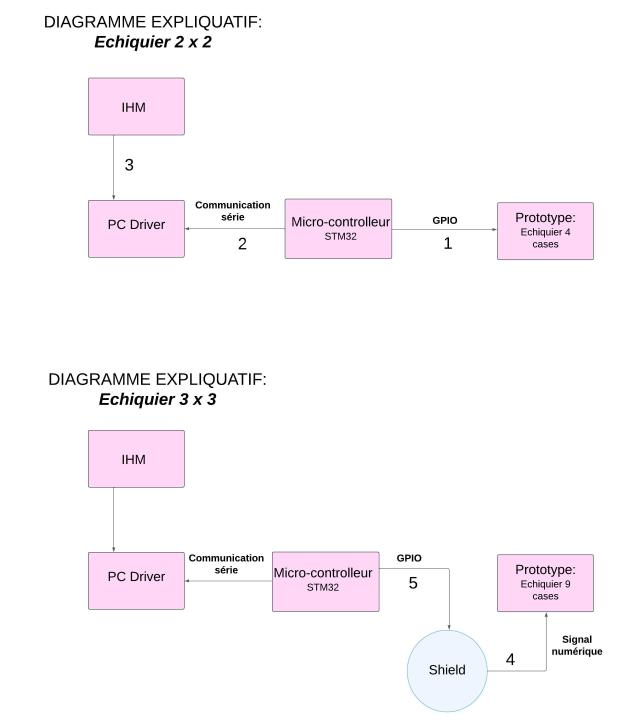
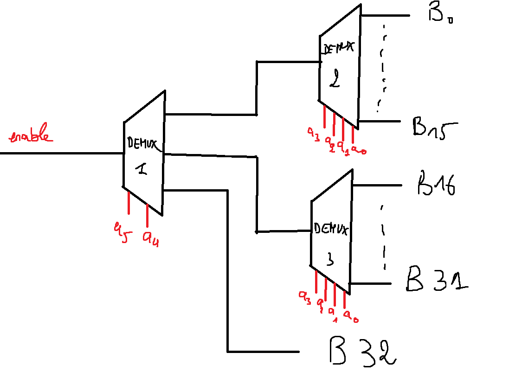

# First Semester Project: Playable Chess Game with STM32 Nucleo L476RG

Final Versions of the project:
-Functional_Linux_Version (snake-like movement)
-Functional_Linux_Version2 (horizontal,vertical and diagonal movement)
-Functional_Linux_Version3 (horizontal and vertical movement only)
-Non_Functional_Windows_Version.

The first semester project aims to build a playable chess game where the user interacts solely with the software on the PC and can watch their movement decisions being played in real time on a real chessboard connected to an STM32 Nucleo L476RG.

The project is divided into three blocks:

## 1) HMI (Human-Machine Interface)
Building a GUI with the chessboard and pieces where the user can play and view the results of their inputs.
The GUI is built using the GTKMM library (works natively on Linux / using MSYS2 on Windows).

The first build of the GUI was a hand-me-down by Ensi Cela, who worked on creating the visual aspect of the UI and its core functionality.

Our role was to fix remaining errors and add functions that return the initial position of the chess piece and its destination as an array.

## 2) Serial Communication with the STM32 Nucleo L476RG

**ONLY THE LINUX VERSION IS FUNCTIONAL, THE WINDOWS VERSION DOESN'T FUNCTION DUE TO MSYS2 INTERFERENCE WITH PORT MAPPING AND PERMISSIONS.**

We have two versions of Serial Communication (Linux with `termios.h` / Windows with `windows.h`).

Both versions are similar in terms of code setup and have been made into classes, so a single object of `ClassCommunicationSerial` can be instantiated in the HMI.

When a user decides to move a piece, the array returned by the HMI will be analyzed, encoded as a byte message, and sent to the STM32 board.

The encoding is done by taking the position, which represents the coil's number (coils are numbered from 1 to 33), then converting the number into bits. The MSB is set to 1 if the coil is to be activated (otherwise, it's 0).

The function responsible for sending the data must send the activation message of each coil. Each message is delayed by 100ms (an arbitrary value) before sending the next one.

## 3) Arduino Code on STM32

The code is fairly simple. Using the included Serial library, we read the message received from the PC and send each bit value to a different pin. The used pins are GPIO only.

The board receives a byte message (8 bits):
- The MSB bit serves as a next state value of the coil.
- The rest are used as the address of the coil:
  - Bits 5 and 6 are used as the address for the demux.
  - The remaining bits are used for the coil number.

Since there are more coils than available pins on the board, we've decided to use a shield made of three demuxes:
- The first demux serves as a driver to determine which demux should be on.
- The latter demuxes are connected to 15 coils each.

### Demux Circuit Diagram

